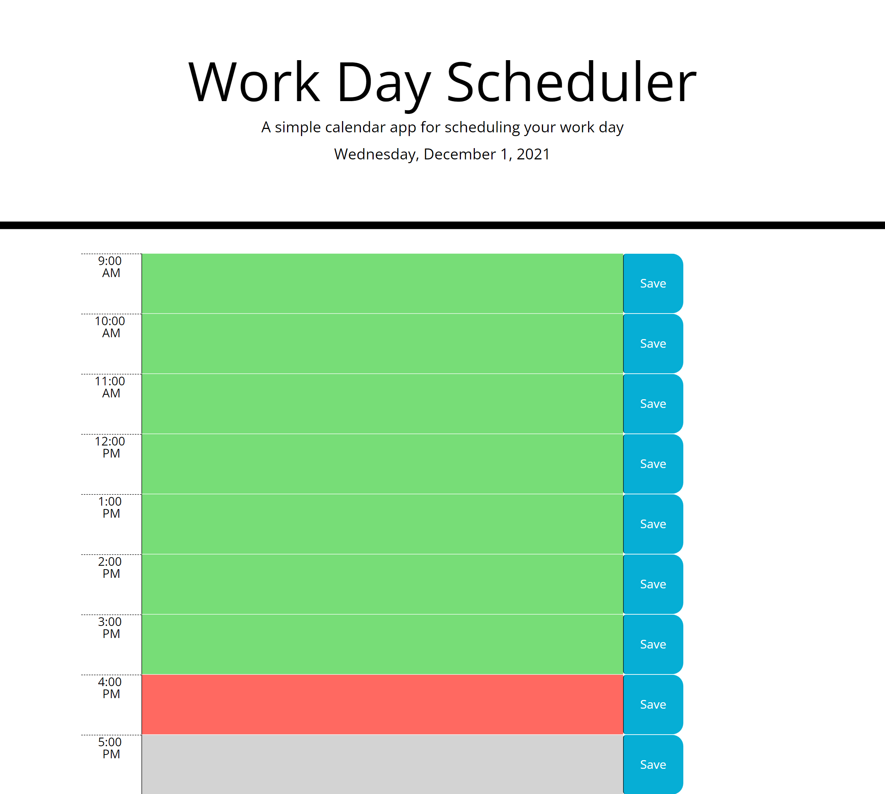

# Hourly ToDo Planner

A one day hourly planner (9am-5pm) allows you to focus on the Tasks/ToDos for that day during the average work time.
Current date is automatically populated at the top of the planner.

## Features

Planner features ability to know whether the taks listed in the planner are scheduled during, past, or after the time you are currently reviewing the planner.

Past, present, and future tasks are highlighted by different colors.

Green = Tasks scheduled for hour(s) prior to the hour you are reviewing the planner.

Orange = Task scheduled for the hour you are currently reviewing the planner.

Grey = Tasks scheduled in the hour(s) coming up after the hour you are currently reviewing the planner.

Input a task/todo in the middle column and click the blue save button to store it in your planner. You may refresh the page or come back later and saved your task will continue to be listed in the time block previously saved.

## Technologies used

Moment.js
JQuery
Bootstrap
Fontawesome

## screenshot

## application link
https://code587.github.io/Hourly-ToDo-Planner/

